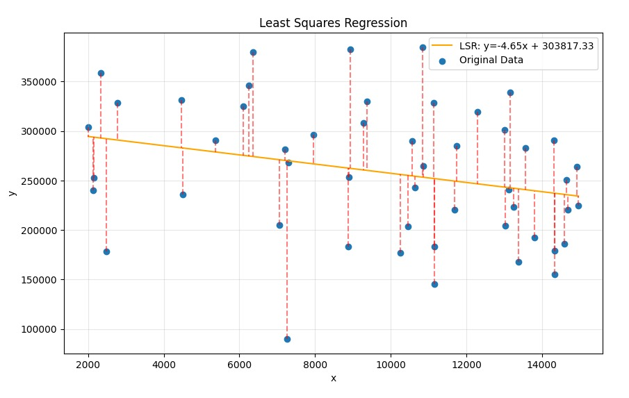

# Least Squares Regression

Trains an LSR statistical model based on a given dataset made out of data points on a 2D array. No library is used other than matplotlib for the graph plots.

## What is LSR?

A Least Squares Regression model is capable of optimizing a linear regression on a given dataset by minimizing its residuals.

### What is a residual?

A residual is basically the distance between a real data point and a predicted y via a linear model. Basically, in ML language, it's the loss function value.

### How do we calculate residuals?

It's simple, basically $(e=y-{\^y})$, which in turn, gives the distance between the predicted value (${\^y}$) and the real value ($y$).

## Finding the optimal regression line

First, we find the mean:

$$
\frac{\sum{x_i}}{n}
$$

This for the $x$ and for the $y$, so: $\bar{x}$ and $\bar{y}$.

After finding the mean for each feature, it's time to find the variance, which will allow us to find the standard deviation:

$$
\sigma^2 = \frac{\sum(x_i - \bar{x})^2}{n-1}
$$

The $n-1$ is important because we are dealing with a sample, not with the population of the data. This is called **Bessel's Correction** and **Towards Data Science** has a very clever explanation to why it matters to this context, you can check it out [here](https://towardsdatascience.com/bessels-correction-why-do-we-divide-by-n-1-instead-of-n-in-sample-variance-30b074503bd9/)!

In this case, we still find the variance ($\sigma^2$) for each feature ($x$ and $y$) so it's actually:

$$
s^2_x = \frac{\sum(x_i - \bar{x})^2}{n-1}
$$

$$
s^2_y = \frac{\sum(y_i - \bar{y})^2}{n-1}
$$

After finding the variance, it's time for the *standard deviation*. This is crucial to understand how the data shifts against the mean, but using standard units based on the original data. Since variance has already been found, it's just a matter of:

$$
s_x = \sqrt{s^2_x}
$$

$$
s_y = \sqrt{s^2_y}
$$

As simple as that.

In LSR, the variance and the standard deviation are our powerful weapons to find the optimal line, because they are needed on the next calculation: the *correlation coefficient*. It's a value between -1 and 1 that indicates how correlated the data truly is. If it's negative, it's negatively correlated, which means that it's on a downward slope, otherwise, it's on a upward slope, just that.

It's crucial to have the correlation coefficient to actually find the $m$ and $b$ of our linear regression. This value is denoted as $r$.

$$
r = \frac{1}{n-1} \sum{(\frac{x_i-\bar{x}}{s_x})(\frac{y_i-\bar{y}}{s_y})}
$$

If you already know some statistics you may notice that the products on the sum are actually the z-scores!

$$
z = \frac{x_i-\bar{x}}{s_x}
$$

That's why standard deviation matters here. We sum the products of the z-scores for each feature to actually find how correlated they are!

Now to actually find the $m$ and $b$:

$$
m = r\frac{s_y}{s_x}
$$

$$
b = \bar{y} - (m\bar{x})
$$

Which in turn gives us:

$$
y = mx+b
$$

And... done!

> The red dashed lines are the actual residuals for each data point given the line generated by the LSR.
